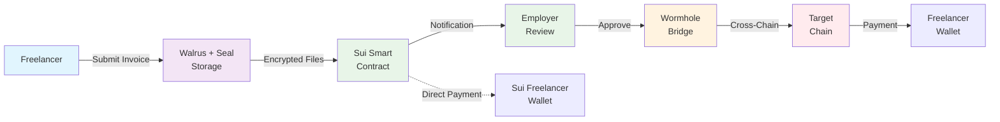

# Swimming Pay
## Cross-Chain Freelancer Payments Platform
**By: Armando Medina and Giovanni Fu Lin**

---

## TEAM

**Armando Medina**  
*Blockchain Developer*
- 30 years of programming experience
- 2.5 years building in web3
- VLAn

**Giovanni Fu Lin**  
*Fullstack Software Developer*
- Fullstack Software Developer
- 3.5 years building in web3

---

## THE PROBLEM

**Cross-Chain Payment Friction**
- Freelancers often want to receive payments on different blockchains than where clients hold their funds
- Manual cross-chain transfers are complex and risky for non-technical users

**Insecure Invoice Management**
- Traditional invoice systems rely on centralized storage vulnerable to breaches
- Lack of decentralized, encrypted solutions for sensitive financial documents
- No trustless way to verify invoice authenticity and secure transmission

---

## THE SOLUTION

**Swimming Pay: Secure Cross-Chain Freelancer Payments**

✅ **Decentralized Encrypted Invoice System**  
Freelancers submit invoices with encrypted file storage on Walrus + Seal (decentralized secrets management) for asymmetric encryption security and trustless document verification

✅ **Cross-Chain Payments via Wormhole**  
Seamless payments from Sui to multiple chains (Ethereum, Sepolia, etc.) with automatic token bridging and delivery

✅ **Sui Native Integration**  
Built on Sui blockchain with wallet-based authentication, smart contract automation, and high-speed transaction processing

---

## HOW IT WORKS

### 1. 📄 Invoice Submission
- Freelancer connects wallet and submits invoice
- Upload invoices as images or PDFs
- AI processes and recognizes document content
- Files encrypted and stored securely on Walrus

### 2. 👥 Admin Review  
- Admin receives notification of pending invoice
- Reviews encrypted invoice after wallet signature verification
- Can approve or reject payment requests
- All actions recorded on-chain for transparency

### 3. 💰 Cross-Chain Payment
- **Pay to Sui**: Direct on-chain payment to freelancer's Sui wallet
- **Pay to Other Chains**: Uses Wormhole bridge for cross-chain transfers
- Supports Ethereum, Sepolia, and other Wormhole-supported networks
- Automatic token bridging and delivery

---

## KEY FEATURES

🔐 **Secure by Design**  
- Wallet-based authentication
- Encrypted file storage on Walrus  
- Admin-only access controls

🌍 **True Cross-Chain**  
- Built on Sui with Wormhole integration
- Support for multiple destination chains
- Seamless token bridging

🤖 **AI-Enhanced**  
- Automatic invoice processing  
- PDF and image recognition
- Streamlined workflow automation

⚡ **Fast & Efficient**  
- Sui's high-speed blockchain
- Quick transaction finality
- Low fees for all parties

---

## TECHNICAL STACK

**Blockchain Infrastructure:**
- **Sui Blockchain**: Primary platform for smart contracts and payments
- **Wormhole Protocol**: Cross-chain messaging and token transfers
- **Walrus Storage**: Decentralized encrypted file storage

**Frontend & Integration:**
- React/TypeScript application
- Sui TypeScript SDK integration
- Modern UI with Radix UI components

**Smart Contract Features:**
- Invoice management and tracking
- Payment authorization and execution  
- Cross-chain transfer coordination

---

## ARCHITECTURE

---

## DEMO HIGHLIGHTS

✨ **Working Features Demonstrated:**
- Complete invoice submission flow
- Encrypted file upload to Walrus
- Admin portal with invoice review
- Wallet signature verification
- Payment processing to Sui
- Cross-chain payment setup (Sepolia integration)

🚧 **Current Status:**
- Core functionality complete and working
- Wormhole cross-chain payments partially implemented
- Ready for production deployment

---

## MARKET OPPORTUNITY

📈 **Growing Freelance Economy**
- $400B+ global freelance market
- Increasing demand for crypto payments
- Need for multi-chain flexibility

🌐 **Cross-Chain DeFi Growth**  
- Multi-chain user adoption accelerating
- Wormhole enabling seamless interoperability
- Sui ecosystem expanding rapidly

---

## FUTURE ROADMAP

🔄 **Phase 1: Cross-Chain Completion**
- Complete Wormhole integration for all supported chains
- Enhanced error handling and retry mechanisms
- Support for multiple token types

📱 **Phase 2: Enhanced Features**
- Mobile-responsive design
- Recurring payment schedules
- Multi-signature admin approvals

🏢 **Phase 3: Enterprise Features**
- Team management and roles
- Invoice templates and automation
- Integration with traditional accounting systems

🌍 **Phase 4: Ecosystem Expansion**
- Support for additional chains beyond Wormhole
- Partnership integrations
- White-label solutions for businesses

---

## WHY SWIMMING PAY?

💡 **Public Good Mission**  
Building infrastructure that benefits the entire multi-chain ecosystem

🏊‍♂️ **Swimming Theme**  
"Swimming" between chains - fluid, natural cross-chain payments

🔧 **Technical Excellence**  
Leveraging cutting-edge tech: Sui, Wormhole, Walrus, AI processing

🤝 **Real-World Problem**  
Solving actual pain points in freelancer-client relationships

---

## GET INVOLVED

**Try the Platform:**  
Connect your wallet and experience seamless cross-chain payments

**For Freelancers:**  
Submit invoices and receive payments on your preferred blockchain

**For Clients:**  
Pay from Sui to any supported chain with just a few clicks

**For Developers:**  
Open source components available for the community

---

*Swimming Pay - Dive into the future of cross-chain freelancer payments* 🏊‍♂️💰
